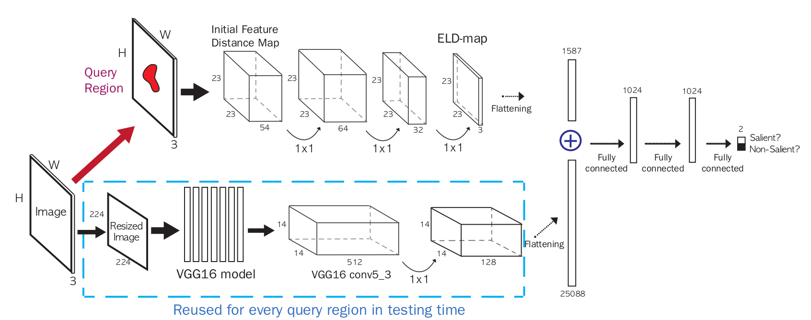

## SaliencyELD

Source code for our CVPR 2016 paper "Deep Saliency with Encoded Low level Distance Map and High Level Features" by [Gayoung Lee](https://sites.google.com/site/gylee1103/), [Yu-Wing Tai](http://www.gdriv.es/yuwing) and [Junmo Kim](https://sites.google.com/site/siitkaist/professor).



Acknowledgement : Our code uses various libraries: [Caffe](http://github.com/BVLC/caffe), [VLfeat](http://www.vlfeat.org), [OpenCV](http://www.opencv.org) and [Boost](http://www.boost.org).

## Usage
1. **Dependencies**
    0. OS : Our code is tested on Ubuntu 14.04
    0. CMake : Tested on CMake 2.8.12
    0. Caffe : Caffe that we used is contained in this repository.
    0. VLFeat : Tested on VLFeat 0.9.20
    0. OpenCV 3.0 : We used OpenCV 3.0, but the code may work with OpenCV 2.4.X version.
    0. g++ : Our code uses openmp and C++11 and was tested with g++ 4.9.2.
    0. Boost : Tested on Boost 1.46

2. **Installation**
    0. Get our pretrained model and VGG16 model. NOTE: Some paths for caffe models and prototxts are hard-coded in **main.cpp**. Check them if you download models in the other folder.

        ```shell
        cd $(PROJECT_ROOT)/models/
        sh get_models.sh
        ```

    0. Build Caffe in the project folder using CMake:

        ```shell
        cd $(PROJECT_ROOT)/caffe/
        mkdir build
        cd build/
        cmake ..
        make -j4
        ```

    0. Change library paths in $(PROJECT_ROOT)/CMakeLists.txt for your custom environment and build our code:

        ```shell
        cd $(PROJECT_ROOT)
        edit CMakeList.txt
        mkdir build
        cd build/
        cmake ..
        make
        ```

    0. Run the executable file which takes one argument for the path of the directory containing test images:

        ```shell
        ./SaliencyELD ../test_images
        ```

    0. The results will be generated in the test directory.

## Results of datasets used in the paper


We provide our results of benchmark datasets used in the paper for convenience.

[ASD results](https://www.dropbox.com/s/mpkxuuok5h4sp7b/ASD_ELD.tar.gz?dl=1) (ASD dataset [site](http://ivrlwww.epfl.ch/supplementary_material/RK_CVPR09/index))

[ECSSD results](https://www.dropbox.com/s/j5xooaqkxpduh51/ECSSD_ELD.tar.gz?dl=1) (ECSSD dataset [site](http://www.cse.cuhk.edu.hk/leojia/projects/hsaliency/dataset.html))

[PASCAL-S results](https://www.dropbox.com/s/o2g9ykynkpqjgdw/pascal_ELD.tar.gz?dl=1) (PASCAL-S dataset [site](http://cbi.gatech.edu/salobj/))

[DUT-OMRON results](https://www.dropbox.com/s/kyomr7lnn42og4q/DUTOMRON_ELD.tar.gz?dl=1) (DUT-OMRON dataset [site](http://202.118.75.4/lu/DUT-OMRON/index.htm))

[THUR15K results](https://www.dropbox.com/s/zu004jx5hc0kabn/THUR15000_ELD.tar.gz?dl=1) (THUR15K dataset [site](http://mmcheng.net/gsal/))


## Citing our work
Please kindly cite our work if it helps your research:

    @inproceedings{lee2016saliency,
        title = {Deep Saliency with Encoded Low level Distance Map and High Level Features},
        author={Gayoung, Lee and Yu-Wing, Tai and Junmo, Kim},
        booktitle = {IEEE Conference on Computer Vision and Pattern Recognition (CVPR)},
        year = {2016}
    }

